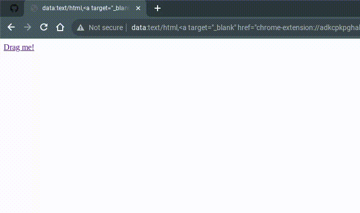

# Evil Printer Un‌blocking
### This method can unblock your chromebook, and all it takes is printing.

 

> The only problem with this is that there will be a little bit of lag while this is running. This exploit may randomly stop working, just do the entire thing again.

1. DON'T CLICK ON THIS LINK (it won't work). Instead, drag this link to your tabs, and a lot of code should pop up.

Link: <a target="_blank" href="chrome-extension://adkcpkpghahmbopkjchobieckeoaoeem/main.js" id="myLink">Drag me!</a>

Ex:

2. Press CTRL+P to bring up the printing page. Set pages to "All" and Layout to "Landscape." Also, copy these settings down below as well. This will create a lot of lag, and you won't be able to open sites right now.

**Make sure that you copied all of those settings.**

3. Press the refresh button on your chromebook's keyboard (don't close that printing screen), then do ALT + D and ALT + Enter. There should be a new tab that opens; don't close this tab! Going on that tab is a bad idea too since it can lag you. 

4. Copy this URL, open a new tab, and paste it in the same place you would paste a normal URL in.

`chrome://extensions/?id=adkcpkpghahmbopkjchobieckeoaoeem`

5. Scroll down until you see `Allow access to file URLs` and flip the switch thing next to it, and then do it again so the switch isn't blue anymore.

6. If you did everything correctly, the old page closed but the new page is still open and it is still loading. Now your chromebook should be unblocked. You will feel a bit of lag but that's it. If you want to stop the exploit and go back to normal without lag, just enter `chrome://restart` in the place where you type URLs, and your chromebook will immediately restart.