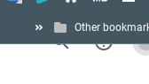

# LOGINpass

> There are 2 ways to do this. The first one probably will be hard to block. The second *will* be easy to block, if you know how to do it. The first requires you to know the email of another person in the IPSD district.

## Important:

```js
let warning = "The top and bottom of the site is chopped off. The bottom can be fixed by going fullscreen. The top will always be chopped off though. That is why this exploit might be annoying."
```

Also, remember that you can use the arrow keys on your keyboard to go back and forward pages.

## Method 1

If you didn't see the start, just note that you need the IPSD email of someone else (you don't need the password or anything else). If you don't have this or want to do it faster, use Method 2. Method 1 will be unblocked for a long time (I think).

1. Go to chrome://chrome-signin
2. Put in the IPSD email
3. Press "Students: I Forgot My Password"
4. Press the blue "Click here"
5. Click on the link in the first step in the website (says "Parent will visit ParentVUE at" and the link)
6. Scroll and press "Android App"
7. At the very top right you will see a little thingy that looks like that, click it and type "Google"

8. Choose the first one
9. Go to the "Data safety" section and press on "See details"
10. Scroll to the very bottom and click on `privacy policy`
11. Scroll to the very bottom and press "Google"

You are done. Now you are in Google. The only benefit of this method is that it's not gonna be blocked for some time.

## Method 2

1. Go to chrome://chrome-signin
2. Put in "google@d11.org"
3. Press "Sign-in options"
4. Press "Sign in with GitHub"
5. Press "Forgot password?" (YOU NEED TO DO THIS)
6. Press the GitHub cat at the top.
7. Press the search thing (top right) and type in `doxrjig` and press the first thing that comes up.

You are done. Press on any of the links or if you have a specific link you need to get to, use the specific site switcher (don't forget https:// in front of the URL)