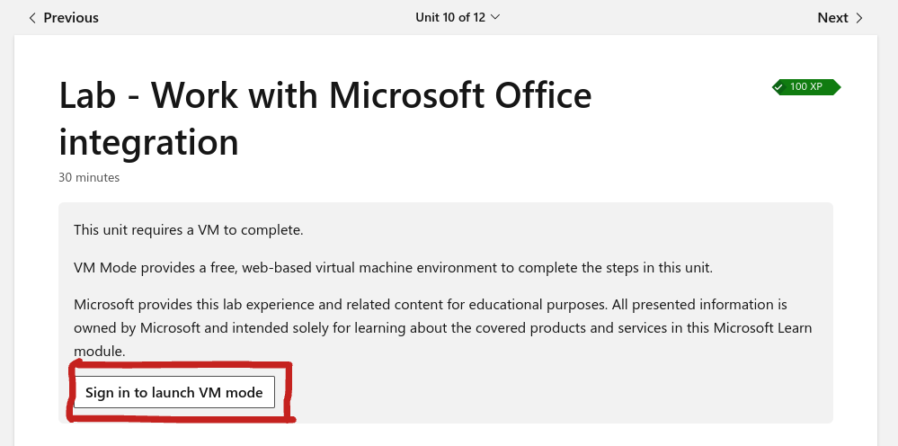
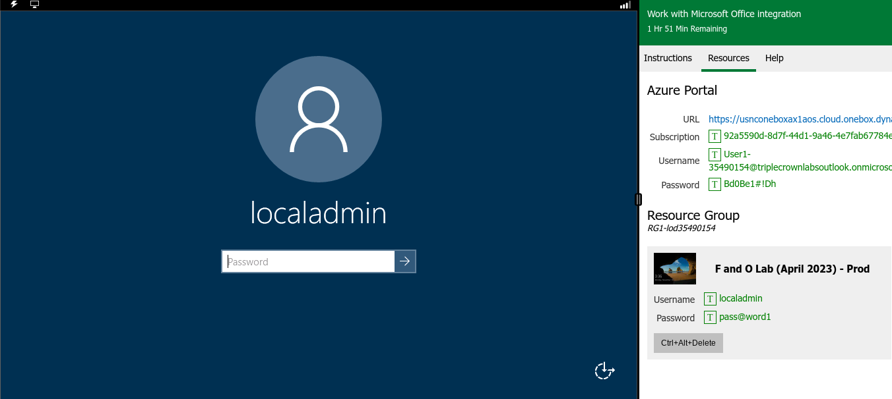

# Windows Laptop Tutorial - doxr

### [https://learn.microsoft.com/en-us/training/modules/implement-common-integration-features-finance-ops/10-exercise-1](https://learn.microsoft.com/en-us/training/modules/implement-common-integration-features-finance-ops/10-exercise-1?source=learn)

> Not everything is unbl0cked; some things will still be blocked. Either figure out how to install a VPN on Microsoft Edge or deal with it :/
> If you see ERR_SSL_PROTOCOL_ERROR it probably means that you were blocked.

For the first time, you will need to sign up. After that, everything should be simple.

## Signing Up

1. Press that
2. Sign in with your school email
3. Microsoft will ask you a few questions. Just choose anything, it doesn't matter much.
4. Finish sign up
5. You might see a captcha. Complete it, and if it doesn't complete, just refresh.
6. Captcha should be gone and you see a button that says "Launch VM mode" in the same place where it said "Sign in to launch VM mode"

## Starting the Windows laptop

1. Press "Launch VM mode" button
2. You should see what the image above shows
3. The password is exactly `pass@word1`
4. Open the Edge Browser!

## Getting a VPN - fully unbl-ck the browser

1. In the laptop in Edge, search up "Edge Addons"
2. In Edge Addons, search for "free VPN"
3. Find a VPN and get/install the extension
4. Press the puzzle piece at the top, and press the eye next to the extension you downloaded
5. Press on the new icon that appears at the top, and then figure out what you have to do to get the VPN working. The VPN might not work, so just installing a different one.
6. Use the VPN. Some stuff might be slower but the browser will be unbl0cked.

Later I might make a tutorial on fully unbl0cked Linux (like Windows) + Chrome which doesn't need a VPN and might be faster.